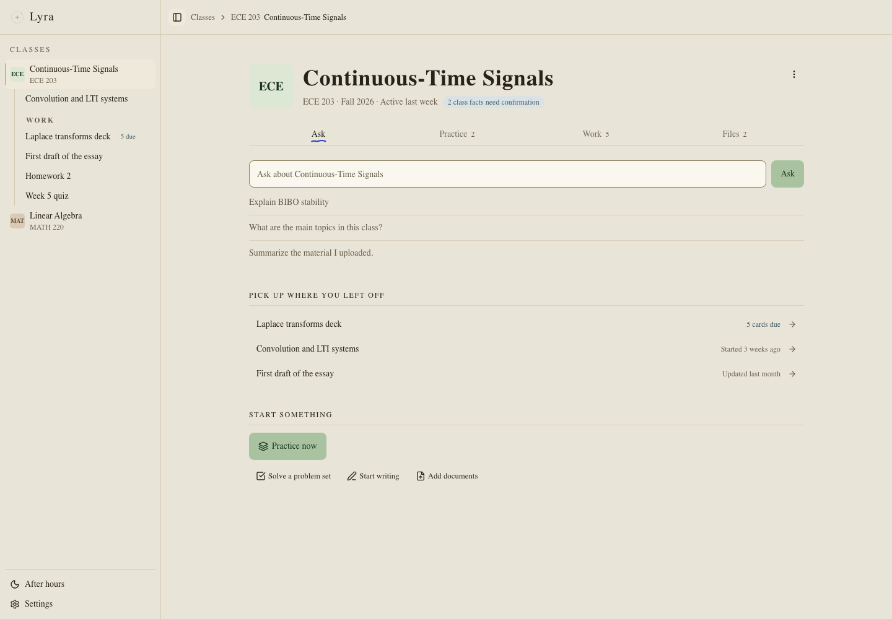

# Lyra

**Your course material, connected to the work you need to do.**

Lyra is a local-first study workspace for students on Mac. Bring your readings and assignments
into a class, ask questions with source references, work through problems, practice with flashcards
and quizzes, and develop drafts without losing track of the material behind them.

[Getting started](docs/beta-testing.md) · [Contributing](CONTRIBUTING.md) ·
[Documentation](docs/README.md) · [Report a bug](https://github.com/oliverdougherC/Lyra/issues/new/choose)

*Current frontend, shown with synthetic demo data. [Screenshot provenance](docs/images/README.md).*

## Try Lyra

**Preparing for the first public beta. No approved public download is available yet.**
The initial target is Apple Silicon Macs running macOS 14 or newer. Intel support and performance
on an 8 GB Mac have not been validated. Follow the
[release evidence ledger](docs/release-evidence.md) for remaining acceptance gates.

Once a beta is approved, installation will be a DMG: open it, drag Lyra to Applications, and launch.
Testers will not need a terminal, Python, Node, or a source checkout. Actions artifacts and draft
releases are review candidates, not approved tester releases. Contributors can
[run from source today](CONTRIBUTING.md#run-from-source).

## Study in one workspace

- **Read and ask:** organize documents by class and follow answers back to their sources.
- **Work through assignments:** prepare solutions and inspect the reasoning and verification.
- **Practice:** generate flashcards and quizzes from selected course material, then review results.
- **Write:** develop a plan, draft, and revisions with your sources alongside your work.
- **Get help with class work:** review the assistant's proposed file changes before applying them.

Generated answers and study material can be wrong. Check source references and your course's rules
for AI assistance before relying on or submitting them.

## Models and privacy

Lyra stores your course files, database, and working history on your Mac. There are no Lyra
accounts, analytics, telemetry, or automatic update checks.

You supply an **OpenAI-compatible tutor endpoint**, either on your own machine or with a remote
provider. Lyra does not bundle a general tutor model. Remote use requires acknowledgement in
Settings and can send selected document text or, for requested text recognition, page images to
that provider. Provider charges and policies apply. Optional web research uses your Exa key.

Document search uses a local embedding model. Its first use downloads about 146 MB of weights;
that download does not upload documents. See [models and first use](docs/beta-testing.md) and
[privacy and data locations](docs/privacy-and-data-location.md) for network behavior, credentials,
backups, and offline limits.

## Contribute

Start with [CONTRIBUTING.md](CONTRIBUTING.md) for setup, tests, and the pull request workflow.
The app combines a Tauri desktop shell, Vite/React frontend, and packaged Python/FastAPI backend.
[Architecture](docs/architecture.md) explains the boundaries;
[local deployment](docs/local-deployment.md) explains how to rebuild and verify `Lyra.app`.

Bug reports should include the app version, Mac model, reproduction steps, and a synthetic example
where possible. Keep private course material and credentials out of public issues. Report
vulnerabilities through the [private security process](SECURITY.md).

## License

Lyra source is licensed under [Apache License 2.0](LICENSE). Third-party components retain their
own licenses. [Distribution notices](docs/distribution-notices.md) document dependency obligations
and the unresolved PyMuPDF distribution review; the source license does not clear those release gates.
