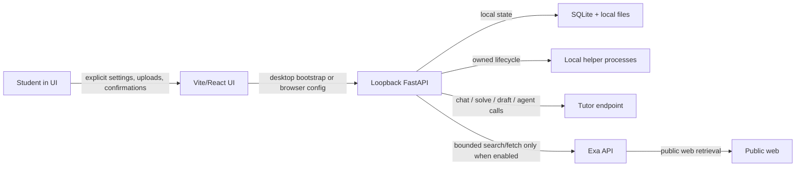

# Phase 4 Threat Model

**Status:** active desktop-migration threat model as of August 30, 2026. This is the live security
model for `Tauri 2 + Vite/React + packaged Python + Exa + remote-or-loopback tutor inference`, not
the older pre-desktop runtime record.

## Scope

The current security boundaries are:

1. a desktop shell that hosts the frontend;
2. a loopback Python backend that owns storage, jobs, and policy;
3. optional local helper processes for embeddings, OCR, and reranking;
4. an OpenAI-compatible tutor endpoint that may be local or remote; and
5. optional Exa-backed web research.

Out of scope: a fully compromised local OS account, physical access, or a tutor endpoint the user
intentionally chose and trusted.

## Assets

| Asset | Required property |
| --- | --- |
| Course documents, drafts, chats, and profile facts | Stay local unless an explicit remote tutor request or web-research request requires otherwise |
| SQLite database and local caches | Never exposed outside the local machine except through explicit user-managed backup/restore |
| Tutor and Exa credentials | Stored via the secret abstraction, never returned in settings responses |
| Desktop bootstrap/session data | Scoped to the local app session and never accepted from arbitrary web origins |
| Local helper processes | Started, adopted, and reclaimed only through Lyra-owned lifecycle rules |
| Web research requests | Bounded, query-guarded, and disabled until configured |

## Actors and attacker inputs

- The student, including accidental approval of a risky action
- An uploaded document containing hostile or misleading text
- A remote tutor endpoint
- A public website returned through Exa
- Another local process able to reach a loopback port
- The model itself, which may invent paths, commands, or claims

Everything the model sees from documents, fetched pages, or workspace files remains untrusted input.

## Trust boundaries

## Invariants

1. The backend is the enforcing authority. The desktop shell and frontend do not get to relax
   storage, network, or confirmation rules.
2. The backend stays loopback-bound and keeps Host/Origin protections even in desktop mode.
3. Remote tutor use is explicit. Non-loopback endpoints are marked remote and require
   acknowledgement before document text is sent there.
4. Exa is opt-in. Missing Exa configuration disables web research without making the rest of Lyra
   unhealthy.
5. Startup must not issue unsolicited provider traffic. Readiness reports configuration, not live
   provider success.
6. Model-proposed filesystem and command actions remain reviewable proposals, never silent side
   effects.
7. Helper-process ownership remains tied to health, identity, and reclaimable lifecycle records.

## Main threats and controls

### T1. Remote tutor exfiltration without informed consent

**Path:** a user or stale configuration points Lyra at a non-loopback endpoint and document text is
sent without an explicit acknowledgement.

**Controls:** endpoint-locality detection, persisted acknowledgement, and per-turn consent checks
before chat, drafting, solving, or agent traffic is sent.

### T2. Web-research leakage through Exa

**Path:** the model tries to place local document text, credentials, or other private context into a
search query or fetch target.

**Controls:** Exa disabled until configured, bounded search/fetch APIs, server-side query guard,
public-URL validation, and explicit auditing.

### T3. Desktop shell bypasses loopback protections

**Path:** packaged mode weakens Host/Origin/session handling because the UI is no longer a plain
browser tab.

**Controls:** the backend keeps the same loopback and mutation-origin policy, and desktop bootstrap
data is treated as a narrow runtime configuration channel rather than a trust waiver.

### T4. Helper-process orphaning or mistaken adoption

**Path:** restarted backends or port changes orphan local inference helpers or adopt a foreign
process.

**Controls:** process-birth identity, health-aware adoption, explicit ownership records, and
deterministic reclaim-on-shutdown tests.

### T5. Historical docs or workflows reintroduce retired assumptions

**Path:** active documentation or CI drifts back to retired pre-desktop runtime language, causing
release, security, or support mistakes.

**Controls:** the active-reference absence scan in CI, plus clear historical labeling on legacy
handoff documents.
