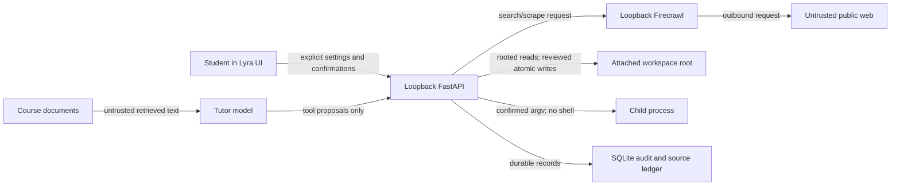

# Phase 4 Threat Model

**Status:** Controls implemented and covered by the automated threat suite on 2026-08-07. The real
Firecrawl public-to-private redirect drill remains a release gate, so scrape stays default-off until
that external acceptance run is recorded. See [phase-4-handoff.md](phase-4-handoff.md).

## Scope

Phase 4 adds three boundaries to Lyra's existing loopback-only, database-centered design:

1. outbound web search and page fetch through a self-hosted Firecrawl service;
2. read and proposed-write access to an explicitly attached class/lab directory; and
3. user-confirmed verification commands inside that directory.

It also lets web research propose class-profile facts. The concurrent writer roadmap uses the same
web toggle and source ledger; it does not get a separate trust model.

Out of scope: defending against an already-compromised operating-system account, a malicious root
process, physical access, or a tutor endpoint the user intentionally configured and trusted. Local
processes are still relevant when they can reach Lyra or Firecrawl over loopback, but Lyra is not an
OS sandbox.

## Existing security properties to preserve

- FastAPI binds to `127.0.0.1`, with the frontend origin allowlisted
  ([architecture.md](architecture.md#2-backend-fastapi)).
- The tutor endpoint is treated as remote unless every resolved address is loopback
  (`backend/llm/locality.py:18-41`). Sending document text to a remote tutor requires explicit
  acknowledgement (`backend/core/app_settings.py:114-136`).
- The tool registry is the complete allowlist, unknown tools are refused, loops have depth and time
  ceilings, and every current call is returned in the loop result (`backend/llm/tools.py:87-170`,
  `326-364`, `404-450`).
- Generated changes are proposals. The draft workspace stores base and proposed content and derives
  review hunks rather than silently mutating the document
  (`backend/storage/migrations/017_drafts.sql:1-18`).

The last two properties are necessary but insufficient once results can contain hostile prose and
tools can affect the host.

## Assets

| Asset | Security property |
| --- | --- |
| Files outside an attached workspace | Never readable, writable, enumerable, or inferable through errors |
| Files inside an attached workspace | Read only after attachment; changed only through reviewed pending edits |
| Processes and commands | Never started by a model call; exact invocation requires a user confirmation |
| Course documents, drafts, profiles, and chat history | Never sent verbatim or unbounded through a search query; disclosed terms are minimized and gated |
| Tutor and future Firecrawl credentials | Keychain/secret storage only; never returned, prompted, or logged |
| Local services and private network | Never reachable through a model-controlled fetch target |
| Web snapshots and citations | Bounded, attributable, immutable as cited, and visibly untrusted |
| Tool history | Durable even when a model turn, stream, worker, or server fails afterward |

## Actors and attacker-controlled inputs

- The student, including accidental acceptance of a dangerous proposal.
- A professor or third party who authored an uploaded PDF containing prompt injection.
- A web page author controlling page text, redirects, links, and large/hostile responses.
- A source repository author controlling comments, fixtures, filenames, symlinks, and tests.
- A compromised or misconfigured Firecrawl service.
- Another local process able to send requests to a loopback port.
- The tutor model itself, which is fallible and may invent tool names, arguments, paths, or claims.

Every document, web result, snapshot, and source file is untrusted data even when it appears in a
`tool` message. Neither a high retrieval score nor a successful HTTP response upgrades its trust.

## Trust boundaries

The UI is the only confirmation surface. A model tool may create a pending edit or command request,
but the tool registry never exposes the apply or execute operation.

## Security invariants

1. **Capabilities are server-enforced.** Hiding a button or omitting a prompt sentence is not a
   control. Every web, workspace, and execution handler resolves current class policy again.
2. **Web and code content are data, never instructions.** Tool results carry an explicit origin and
   trust label; system prompts delimit them and forbid following embedded instructions.
3. **The model cannot commit a host side effect.** It may snapshot a public source into the local
   ledger and create database proposals. Only a user-only API can apply a file hunk or start a
   process.
4. **Paths are authorized by identity, not spelling.** Resolve and open beneath one approved root;
   reject absolute paths, `..`, symlinks, junctions/reparse points, devices, sockets, and escapes.
   Recheck immediately before mutation.
5. **Network targets are public.** Firecrawl itself must be loopback. Target URLs must be HTTP(S),
   contain no credentials, resolve only to globally routable addresses, and be revalidated after
   redirects. The current documented Firecrawl v2 schema exposes no request-level threat-protection
   option, so scrape additionally requires a verified pinned build and private-network egress block;
   otherwise it stays disabled.
6. **Audit is synchronous with the action.** A tool attempt is persisted before its result is handed
   back to the model. A later timeout cannot erase the record.
7. **Bounds fail closed.** File size, response size, output, depth, time, redirect, and match-count
   ceilings report a refusal; truncation is visible and never presented as a complete source.
8. **Consent is narrow and revocable.** Web access, workspace attachment, file application, and
   command execution are distinct grants. Enabling one never enables another.
9. **Agent turns honor the tutor-endpoint consent rule.** The class agent's model calls are made by
   `run_tool_loop` against the configured tutor endpoint, and every round of that loop carries
   private material: the conversation history and the student's message on the first round, and
   workspace file contents, fetched-page evidence, and command-planning context as tool results
   re-enter the context on later rounds. `send_agent_chat` therefore takes the same coherent
   `resolve_tutor_access` snapshot as tutor chat — endpoint and document-text permission from one
   settings read — and refuses an unacknowledged non-loopback endpoint before the user turn is
   persisted, before the tool registry is built, and before any upstream request, re-deriving the
   consent on every turn. The one deliberate exception is already non-private by construction: the
   `research` profile's web-search queries go to the loopback Firecrawl service (not the tutor
   endpoint) and are synthetic, bounded probe strings that the T7 query guard prevents from
   carrying document text, secrets, or verbatim private context. That distinction is the contract:
   search queries are minimized instead of gated; everything that enters the model context is
   gated by the endpoint acknowledgement.

## Threats and required mitigations

### T1. Indirect prompt injection escalates tools

**Path:** a document, web page, or source comment tells the model to ignore Lyra's instructions,
exfiltrate files, apply a patch, or run a command.

**Controls:**

- keep web/code reads and proposal tools in capability-specific registries;
- never expose `apply_change` or `execute_command` as model-callable tools;
- wrap untrusted content in a structured envelope containing origin, source ID/path, truncation, and
  `trust="untrusted"` rather than concatenating it as free prose;
- allow web/code content to cause only a reviewable proposal;
- show the provenance of each proposal in the UI;
- test hostile instructions in all three content sources.

**Residual risk:** hostile text can still bias the model's proposed answer or edit. Human review and
provenance reduce impact; they do not make the model's reasoning trustworthy.

### T2. Server-side request forgery through Firecrawl

**Path:** the model supplies loopback, RFC1918, link-local, metadata, IPv6-local, credential-bearing,
or public-to-private redirect URLs. Firecrawl runs locally and may reach services the browser cannot.

**Controls:**

- allow only a Firecrawl base URL that resolves entirely to loopback;
- validate every initial target with a shared public-URL policy;
- accept only returned final URLs that pass the same public-URL policy;
- send only documented v2 fields; explicitly set `skipTlsVerification=false` and do not allow request
  headers, cookies, authenticated profiles, actions, browser interaction, proxy selection, or
  cache-only `lockdown` for a fresh research fetch;
- document the remaining redirect/DNS-rebinding exposure of the self-hosted service and recommend a
  container egress policy blocking private/link-local ranges; require that policy for scrape unless
  the pinned build itself proves the redirect case;
- pin and smoke-test the self-hosted Firecrawl release rather than following `latest`.

**Release gate:** if the pinned Firecrawl build cannot demonstrate public-to-private redirect
blocking, `fetch_source` remains disabled; search metadata may ship without fetch.

### T3. Path traversal, symlink escape, and time-of-check/time-of-use races

**Path:** a model invents `../`, an absolute path, a symlink inside the root points outside, or a file
is replaced between validation and apply.

**Controls:**

- store one canonical, user-approved root per workspace and expose only opaque workspace IDs to the
  model;
- accept normalized relative paths only;
- use descriptor-relative/no-follow operations where the platform supports them; otherwise compare
  canonical parent and target paths immediately before every open and replace;
- refuse symlinks and non-regular files for reads and writes;
- bind pending changes to workspace ID, path, file identity where available, base hash, and newline
  mode; stale content returns to review rather than overwriting;
- atomic temp-file replacement occurs in the validated parent and preserves file mode.

### T4. A proposal becomes a silent write

**Path:** a model tool directly edits a file, the frontend auto-accepts, or a stale pending edit lands
over newer work.

**Controls:**

- model tools can only create `workspace_changes` rows;
- the response and transcript say “proposed,” never “changed”;
- per-hunk acceptance is a user action; rejection never writes;
- the apply route recomputes current content and staleness server-side;
- every accepted write creates an audit record with before/after hashes and accepted hunk IDs.

### T5. Command execution escapes the workspace or hides intent

**Path:** shell metacharacters, a wrapper executable, a malicious test, environment secrets, child
processes, or an innocent-looking command mutates arbitrary files or opens the network.

**Controls:**

- Phase 4 has no arbitrary shell tool. The model creates a `command_request` containing an argv
  array, validated cwd, reason, and expected output;
- the UI displays the exact executable, every argument, cwd, timeout, and network warning;
- each run requires explicit confirmation; no “always allow” or session-wide approval;
- execute with `shell=False`, a minimal environment, capped stdout/stderr, wall-clock timeout, and
  process-group termination;
- never inject tutor/Firecrawl/API secrets into the child environment;
- do not run commands while applying hunks or as a hidden post-save hook.

**Residual risk:** an explicitly approved interpreter or test suite can execute arbitrary code. The
confirmation text must say this plainly. Stronger sandboxing belongs to a future measured phase.

### T6. Audit history disappears on partial failure

**Path:** a tool runs, then the model loop times out, SSE disconnects, worker crashes, or message
persistence fails.

**Controls:**

- insert `tool_audit_events` at dispatch and finish it in the same handler boundary;
- record rejected policy decisions and malformed calls as well as successes;
- store bounded/redacted arguments, target identity, result summary, start/end, caller context,
  policy decision, and failure reason;
- `agent_attempt_targets` is the canonical proposal-to-attempt join. It is inserted in the same
  transaction as each new workspace change, command request, source/revision, excerpt, or profile
  fact, so terminal audit failure cannot orphan ownership. Its target key is unique and
  insert-only: Retry creates new ownership rows for new records and cannot relabel a deduplicated
  record that an earlier attempt produced. The audit row's `(target_kind, target_id)` is the normal
  activity projection, not the sole source of causal truth;
- the transcript queries durable events, not only a final assistant-message blob;
- startup reconciliation marks abandoned in-flight events explicitly.

### T7. Search-query or fetch-based data exfiltration

**Path:** the model places document text, secrets, code, or profile data in a search query or URL.

**Controls:**

- network search does not accept an arbitrary model string directly. A server-side query guard
  normalizes the proposed query, limits it to 12 terms/500 characters, rejects URLs, local paths,
  emails, credential/secret patterns, long high-entropy tokens, quoted passages, and normalized
  verbatim overlap with the private context available to that turn;
- the query guard runs after the class web grant is resolved and before every Firecrawl call; a
  refusal is audited and handed back to the model as a policy result;
- research query generation uses a narrow context containing the user's visible topic/assignment and
  approved plan headings, not raw retrieved chunks, source files, profiles, full chat history, or
  prior untrusted tool output;
- search arguments remain visible in the activity card and have a short character ceiling;
- prompts reinforce, but do not replace, the server guard;
- reject URLs with credentials and redact query strings in logs/audit displays;
- never pass full documents, source files, profile rows, API keys, or chat history to Firecrawl;
- the web toggle copy states that search terms and requested URLs leave the machine for public sites.

**Residual risk:** a model can paraphrase or infer sensitive information into ordinary-looking search
terms, and a method name from a private course document is sometimes the intended disclosure. Phase
4 prevents verbatim/bulk/obviously secret exfiltration and makes the bounded query visible; it does
not claim semantic noninterference from an untrusted model. Web remains default off.

### T8. Resource exhaustion

**Path:** huge pages, recursive searches, giant repositories, binary files, endless output, or too
many tool rounds exhaust disk, memory, model context, or child processes.

**Controls:** bounded result counts, bytes, characters, redirects, directory entries, search matches,
file sizes, tool rounds, command output, concurrency, and time. Snapshots record truncation. Only one
command per workspace runs at a time. No Firecrawl crawl/map/agent/browser endpoints in Phase 4.

### T9. Source and citation integrity fails

**Path:** a page changes after use, an excerpt is invented, a result title does not match its source,
or a profile fact cites an inaccessible URL.

**Controls:** store the fetched snapshot, final URL, title, access time, content hash, exact relied-on
excerpt, and truncation state. Bind citations/facts to ledger IDs. Confirmation shows the excerpt and
source. Refresh creates a new source revision rather than silently rewriting cited evidence.

### T10. Loopback endpoints are invoked outside the UI

**Path:** a malicious website, extension, or local process calls apply/execute routes.

**Controls:** reject any request whose `Host` header is not a Lyra loopback host (`127.0.0.1`,
`localhost`, `::1`; any port) before routing, so a DNS-rebinding page that stays same-origin to a
name rebound to `127.0.0.1` is refused on its `Host` alone, independent of `Origin`. Beyond that,
keep JSON-only mutating routes behind strict CORS/origin checks and reject form/simple
content types. A preflight returns a cryptographically random nonce with at least 256 bits of entropy;
the backend stores only its hash, expires it after 120 seconds, consumes it atomically once, and binds
it to origin, class/session context, action kind, target ID, current hash, and exact command/change.
Loopback remains the primary boundary. The nonce prevents cross-origin/replay mistakes; a malicious
local process able to call both preflight and confirm is equivalent to the local user for this
single-user, unauthenticated application and is a documented residual risk.

## Security acceptance suite

1. Web disabled globally or for the class: search/fetch schemas are absent and handlers still refuse
   direct calls.
2. Firecrawl base URL: remote, mixed-DNS, malformed, credential-bearing, and non-loopback endpoints
   are refused.
3. Target URL: loopback, private, link-local, reserved, IPv4-mapped IPv6, `.local`, credentials, and
   public-to-private redirects are refused.
4. A page, PDF, and source file containing an edit/execute injection cannot create anything stronger
   than a visible pending proposal.
5. `../`, absolute paths, symlinks, renamed symlinks, case-folding escapes, and non-regular files fail
   for list/read/search/propose/apply.
6. Editing the file after proposal makes apply stale; no bytes change.
7. Rejecting all or one hunk writes nothing; accepting selected hunks changes only those hunks and
   records hashes.
8. No process starts before a valid single-use confirmation; replay fails; `shell=True` is never used.
9. Timeout kills the process group, retains bounded output, and leaves a terminal audit event.
10. A tool side effect followed by loop timeout/server error remains visible after restart.
11. Search/fetch/file/output ceilings visibly report truncation or refusal.
12. A cited source refresh preserves the exact snapshot/hash used by the earlier claim.
13. Registry enumeration proves web/workspace/command profiles never combine outside the permitted
    matrix and no model registry contains apply/execute handlers.
14. Query guard tests reject private-context verbatim overlap, URLs/paths/emails/secrets/high-entropy
    tokens and allow bounded ordinary topic queries; every rejection is audited.
15. Confirmation nonces contain at least 256 bits of entropy, expire at 120 seconds, are atomically
    single-use, and fail when origin/context/target/hash/action differs.

## Release decision

Security review blocks Phase 4 if any invariant is missing, if filesystem/execute functions appear in
a model registry, if Firecrawl fetch cannot pass the redirect test, or if a known high/critical
dependency finding is introduced. Medium residual risks must be documented in the release handoff.
